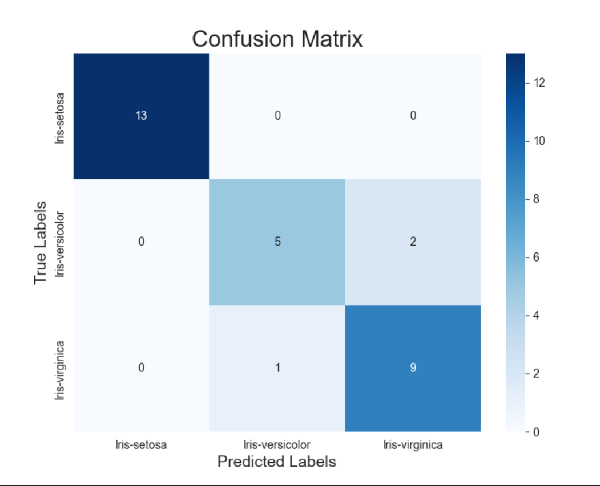
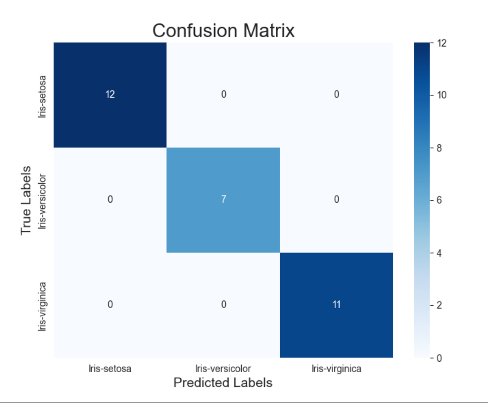

# Overview

Machine Learning has been one of the stepping stones for the development and more recent boom on Artificial Intelligence as 
we know it today. Machine Learning itself has other areas of expertise such as Calculus, Computer science and programming 
that have been around for quite some time now. All these factors or 'ingredients' have been cooking for a long time. 

This project features a simple Python code using multiple libraries. It features Sklearn as the LLM to read data from a
CSV file and use the data to be able to predict the specie of the flower by the size and measurements of the petals. 
Seaborn is implemented to graph results and analyze the effectiveness of the Model. 

Confusion Matrix of the model:
## First iteration of the MLM with some errors 

## Second iteration of the MLM with 100% accuracy

Special thanks to Leonardo Flores, BYU-I professor for his mentorship and expertise.

[Software Demo Video](https://youtu.be/vdAu6rEkrbA)

# Development Environment

 - JetBrains PyCharm 2024 1.1
 - Python 3.10
 - Numpy 
 - Matplotlib
 - Sklearn
 - Seaborn
 - Pandas

# Useful Websites

{Make a list of websites that you found helpful in this project}
* [Research on MNIST numbers recognition CNN](https://iopscience.iop.org/article/10.1088/1742-6596/2138/1/012002)
* [Understanding the math behind neural networks](https://web.archive.org/web/20210423082804/https://www.samsonzhang.com/2020/11/24/understanding-the-math-behind-neural-networks-by-building-one-from-scratch-no-tf-keras-just-numpy.html)
* [Simple MNIST NN from scratch (numpy, no TF/Keras)](https://www.kaggle.com/code/wwsalmon/simple-mnist-nn-from-scratch-numpy-no-tf-keras/notebook)
* [3blue1Brown Video Series "But what is a neural network? | Deep Learning"](https://www.youtube.com/watch?v=aircAruvnKk)
* [Seaborn API](https://seaborn.pydata.org/generated/seaborn.heatmap.html)
* [Sklearn Machine Learning Model](https://scikit-learn.org/stable/modules/classes.html#module-sklearn.metrics)